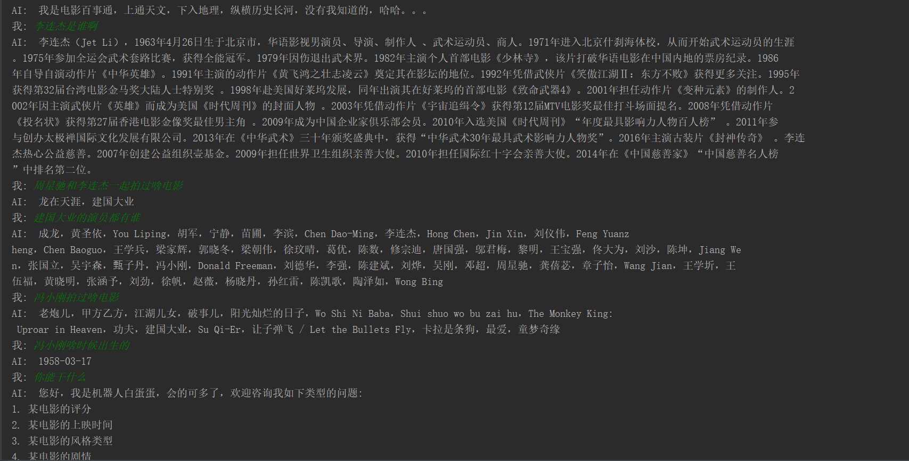
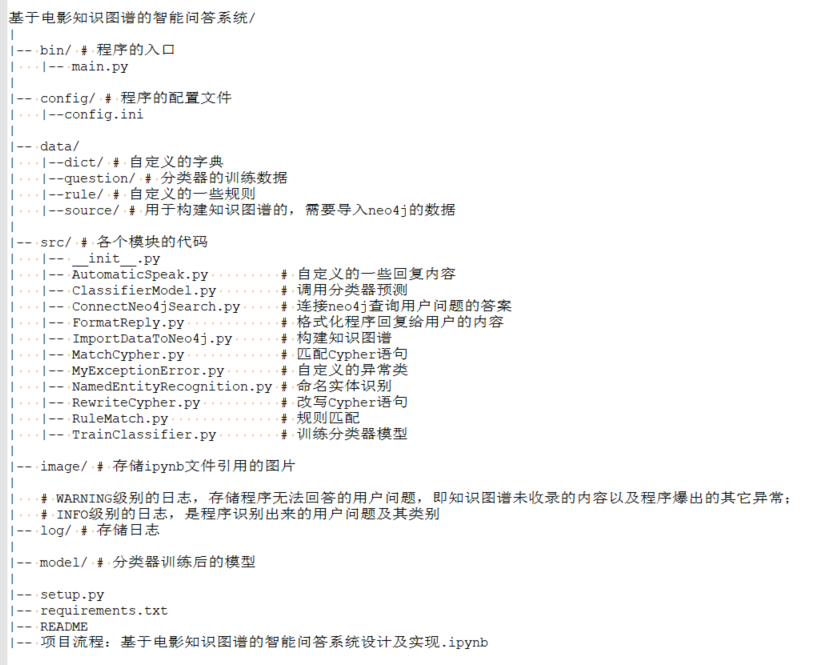
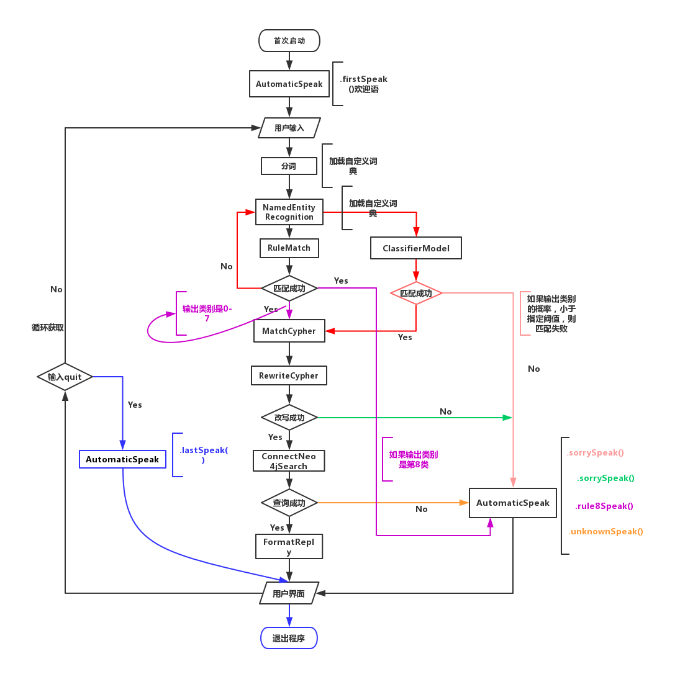

# 对话效果展示

# 写在前面

本项目是笔者兴趣而起，做的一个Demo级别的 KGQA。从2019.5.1晚上-2019.5.7日 发布起，耗时差不多一周。从各个模块的功能设计到模块间的交互，中间的细节令人咂舌，笔者估计用不了几周，连自己都会忘得差不多，因此为了避免自己遗忘程序的细节和具体实现，以及有助于阅读本项目的朋友，笔者额外写了一份本项目的教程，初学者可以先粗读一下`项目流程：基于电影知识图谱的智能问答系统设计及实现.ipynb` 和 `项目主程序流程图`。

本项目的不足：

1. 未使用protege进行OWL本体建模，因此本项目缺乏一些推理能力

2. 对本体的属性挖掘并不彻底，以及属性的数据类别也不是很统一，因此无法做到回答更多类型的问题，比如：出生在同一天的演员，出生在同一地区的演员，上映在同一年的电影 等

3. 缺乏程序与用户的交互界面，本来想着用pyqt5写一个，但考虑了一下学习时间，就暂时放弃了

4. 数据缺乏：
    1. 知识图谱中存储的数据并不充分
    2. 用于训练分类器和挖掘规则的数据，也都是笔者用脑仁硬写的。。。
    
    
5. 虽然笔者暂时想不起来，但一定有。。。。

笔者目前仍是在读学生，有问题可以交流，联系`wechat: damo894127201`

# 项目安装

**本项目是在`win10`下开发的，运行环境都只在`win10`下测试过，其它版本的系统，笔者并没有测试！**

## 安装neo4j

需要安装`neo4j`图形数据库，作为知识图谱的存储载体，具体安装过程，读者可以参考相关博文。

## 将数据导入neo4j

你需要首先构建自己的知识图谱，需要存储到neo4j的数据，存储在`./data/question/`中，读者可以通过两种方式建立自己知识图谱：

1. 通过Cypher语句将数据直接导入`neo4j`
2. 通过Python库`py2neo`连接`neo4j`，导入数据 : `./src/ImportDataToNeo4j.py`

这两种方式的细节请查看：`项目流程：基于电影知识图谱的智能问答系统设计及实现.ipynb` 第四章

## 安装requirements.txt中的Python库

`pip install package_name` 即可，都是很容易安装的包。当然读者也可以通过`python setup.py install`来安装。

## 运行程序开启对话

在你运行`./bin/main.py`开启对话前，读者需要首先启动自己的`neo4j`，并且到配置文件`../config/config.ini`中设置自己的`neo4j`的用户名和密码，配置文件中的用户名和密码都是`neo4j`默认的。启动`neo4j`的命令:`neo4j.bat console`。

# 项目数据来源

本项目的数据来源于`CSDN博主appleyk` 的 [基于电影知识图谱的智能问答系统](https://blog.csdn.net/Appleyk/article/details/80331997)系列博客 ，感谢`appleyk`的无私奉献！

本项目与原项目的区别：

1. 本项目是基于Python开发的，原项目是JAVA开发的；

2. 本项目在分类问题时，采用了规则识别和分类器识别两种方案；原项目只有单一的分类器识别一种方案；

3. 本项目在实现时，参考了原项目一部分思路；

# 项目目录结构

特别需要注意：

1. WARNING级别的日志：可用于改善知识图谱

2. INFO级别的日志：用于改善规则和分类器

# 项目主程序流程图

